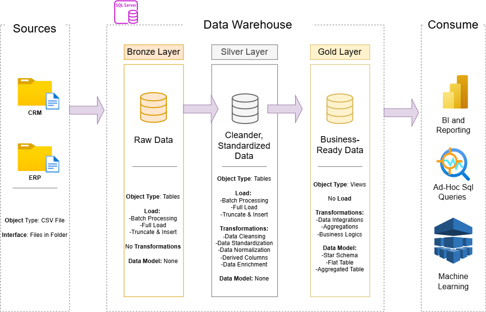

tekstu, który można bezpośrednio skopiować:

# Data Warehouse and Analytics Project

Welcome to the **Data Warehouse and Analytics Project** repository!  
This project demonstrates a comprehensive data warehousing and analytics solution, from building a data warehouse to generating actionable insights. Designed as a portfolio project, it highlights industry best practices in data engineering and analytics.

---

## 📋 Project Requirements

### 🏗️ Building the Data Warehouse (Data Engineering)

#### 🎯 Objective
Develop a modern data warehouse using SQL Server to consolidate sales data, enabling analytical reporting and informed decision-making.

#### 📝 Specifications
- Data Sources: Import data from two source systems provided as CSV files.  
- Data Quality: Cleanse and resolve data quality issues prior to analysis.  
- Integration: Combine both sources into a single, user-friendly data model designed for analytical queries.  
- Scope: Focus on the latest dataset only; historization of data is not required.  
- Documentation: Provide clear documentation of the data model to support both business stakeholders and analytics teams.

---

### 📊 BI: Analytics & Reporting (Data Analytics)

#### 🎯 Objective
Develop SQL-based analytics to deliver detailed insights into:
- Customer Behavior  
- Product Performance  
- Sales Trends  

These insights empower stakeholders with key business metrics, enabling strategic decision-making.

---

## 🏗️ Data Architecture

The data warehouse pipeline is organized into three main layers:  

1. Bronze (Raw Data) – Stores raw data exactly as it comes from source systems. Minimal processing is applied.  
2. Silver (Cleaned Data) – Data is cleaned, validated, and normalized to ensure consistency and usability.  
3. Gold (Analytical Data) – Aggregated and modeled data ready for analytics, reporting, and visualization.  

This structure demonstrates a simple ETL workflow, showing how data flows from raw sources to analytical outputs.

---

## ⚡ How to Run

1. Clone the repository using Git:  
   git clone YOUR-REPO-LINK-HERE

2. Open your database and run the SQL scripts in order:  
   - Bronze  
   - Silver  
   - Gold

3. Check the Gold tables for final results (ready for analysis or reporting)

---

## 🛠️ Technologies

- SQL Server  
- draw.io / diagrams.net (architecture diagram)

---

## 📂 Folder Structure

/sql/bronze/       -> raw data  
/sql/silver/       -> cleaned data  
/sql/gold/         -> final tables  
/docs/diagram.png  -> architecture diagram

---

## 🧠 Junior-Level Takeaway

This project demonstrates that I can:  
- organize data in a simple ETL pipeline  
- think in terms of data layers (bronze → silver → gold)  
- prepare data for analysis and reporting

---

## 📄 License

This project is licensed under the MIT License. You are free to use, modify, and share this project with proper attribution.
